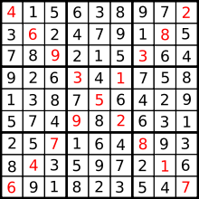

## Sudoku

bon ben je crois que tout est dit dans le titre, à vous de jouer !

Quelques détails tout de même, on ne vous demande pas de coder un programme capable de résoudre une grille donnée (sauf si
vous voulez vous initier aux joies du [retour arrière/retour sur trace/backtracking](https://fr.wikipedia.org/wiki/Retour_sur_trace)),
 juste de déterminer si une grille donnée (sous forme d'un tableau de tableaux) et déjà remplie est valide ou pas.  
 
Comme d'habitude ~~Je me lève et je te bouscule
                   Tu n'te réveilles pas
                   Comme d'habituuudeeeeee~~ (oups désolé, j'ai confondu Soudoku avec karaoké) on vous fournit gracieusement un fichier de tests pour vous
 guider dans vos recherches.

Pour celles et ceux qui ne connaîtraient pas le principe de ce jeu, quelques précisions:  
Voici comment se présente une grille de Sudokou:  

Une grille de Sodoku se présente sous la forme d'une grille carrée de 9 lignes et 9 colonnes subdivisée en 9 sous-grilles carrées 
de 3 par 3 cases, appelées « régions », et partiellement pré-remplie avec des chiffres de 1 à 9.  
Le but de ce jeu (*pas celui du kata, puisqu'ici on vous donne la grille déjà entièrement remplie!*) est de remplir entièrement la grille avec les chiffres de 1 à 9 de telle façon que 
chaque chiffre apparaisse **une
fois et une seule** dans chaque ligne, dans chaque colonne et dans chaque région.

Voici un autre exemple de grille de Sudolu résolue, dont les chiffres initiaux figurent en rouge, sur les diagonales:  

Pour plus de détails sur l'historique, les méthodes de résolution, etc: [l'article de wikipedia sur le Soudoku](https://fr.wikipedia.org/wiki/Sudoku)
 
Vous trouverez dans le même répertoire un fichier de tests (thanks to [codewars](https://www.codewars.com/) pour les grilles),
 le but étant évidemment que votre code ~~casse la baraque~~ passe les tests !

#### Conseils pour les juniors
Un conseil (d'ailleurs j'ai rajouté des tests en ce sens, donc ce n'est plus un conseil mais une obligation !): 
"diviser pour règner", décomposer le problème, ici en créant des méthodes pour :
 * isoler les lignes (ça ne sera pas le plus 
dur ;-) )
 * une autre pour les colonnes (si vous cherchez bien dans la [doc officielle](https://ruby-doc.org/core-2.6.5/Array.html), 
vous verrez qu'il existe une méthode pour cela, j'dis ça, j'dis rien bien-sûr)
 * et encore une autre pour les régions. Pour cette dernière, je vous conseille de noter sur papier vos recherches, 
 notamment pour voir les indices des élèments ou des triplets. Et vous faites du Ruby, donc évitez les boucles *while* et
 *for*, utilisez plutôt [Array#each](https://ruby-doc.org/core-2.6.5/Array.html#method-i-each) ou ses dérivées telle [Enumerable#each_slice](https://ruby-doc.org/core-2.6.5/Enumerable.html#method-i-each_slice).  
 la méthode [Range#step](https://ruby-doc.org/core-2.6.5/Range.html#method-i-step) peut aussi vous être utile. *ce sont des pistes/conseils, pas des obligations !*
 * Plus une dernière méthode qui vérifie si chaque partie (ligne, colonne ou région) est correctement remplie, donc avec 
tous les chiffres de 1 à 9, chacun présent une seule fois (avec, par exemple l'utilisation de la structure de données [Set](https://ruby-doc.org/stdlib-2.6.5/libdoc/set/rdoc/Set.html), 
qui est comme un Array mais où chaque élèment est unique, mais, encore une fois, c'est juste une suggestion, pas une obligation).  
Vous remarquerez que cette méthode ".valid?" teste des tableaux/Array, 
donc vous allez utiliser une propriété de Ruby : la possibilité de réouvrir une classe, y compris celles de base de Ruby, 
ici "Array" pour y rajouter des méthodes. **Ceci (la réouverture de classes de base de Ruby) n'est pas à utiliser en prod**

N.B. Petit test d'attention : avez-vous remarqué que, pas une seule fois (hormis dans le titre de ce README) le nom de 
ce jeu n'a été correctement orthographié :-) ?

#### Pour les tests
Pour lancer les tests fournis, vous aurez besion de la gem Minitest. Pour l'installer, ouvrez votre terminal
et lancer la commande suivante:

    gem install minitest

Si vous voulez une sortie  en couleurs, rajoutez `require 'minitest/pride'` en haut du fichier test, ou notez l'instruction
 alternative, ci-dessous, pour lancer le fichier test.

Pour lancer les tests, depuis le dossier de l'exercise, utilisez cette commande:

    ruby sudoku_test.rb

pour inclure la couleur, utiliez plutôt cette commande:

    ruby -r minitest/pride sudoku_test.rb

### English version

The goal of this kata is to check if an already filled grid is good or not (each and every row, column, and region (a 3x3 
box) contains the numbers one through nine only once..) for [more explanations of this game, the Wikipedia page](https://en.wikipedia.org/wiki/Sudoku).

With this README, you can find in the same directory a file with some tests.

For running the tests provided, you will need the Minitest gem. Open a
terminal window and run the following command to install minitest:

    gem install minitest

If you would like color output, you can `require 'minitest/pride'` in
the test file, or note the alternative instruction, below, for running
the test file.

Run the tests from the exercise directory using the following command:

    ruby saddle_points_test.rb

To include color from the command line:

    ruby -r minitest/pride saddle_points_test.rb

