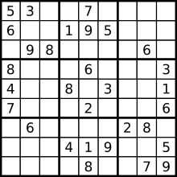

## Sudoku

bon ben je crois que tout est dit dans le titre, à vous de jouer !

Quelques détails tout de même, on ne vous demande pas de coder un programme capable de résoudre une grille donnée (sauf si
vous voulez vous initier aux joies du [retour arrière/retour sur trace/backtracking](https://fr.wikipedia.org/wiki/Retour_sur_trace)), juste de déterminer si une grille donnée (sous forme d'un tableau de
tableaux) est valide ou pas.

Pour celles et ceux qui ne connaîtraient pas le principe de ce jeu, quelques précisions:  
Voici comment se présente une grille de Sudoku:  

Une grille de Sudoku se présente sous la forme d'une grille carrée de 9 lignes et 9 colonnes subdivisée en 9 sous-grilles carrées 
de 3 par 3 cases, appelées « régions », et partiellement pré-remplie avec des chiffres de 1 à 9.  
le but est de remplir entièrement la grille avec les chiffres de 1 à 9 de telle façon que chaque chiffre apparaisse une  
fois et une seule dans chaque ligne, dans chaque colonne et dans chaque région.

Voici un autre exemple de grille de Sudolu résolue, dont les chiffres initiaux figurent en rouge, sur les diagonales:  

Pour plus de détails sur l'historique, les méthodes de résolution, etc: [l'article de wikipedia sur le Sudoku](https://fr.wikipedia.org/wiki/Sudoku)
 
Vous trouverez dans le même répertoire un fichier de tests (thanks to [codewars](https://www.codewars.com/)), le but étant 
évidemment que votre code ~~casse la baraque~~ passe les tests !

Pour les juniors, un conseil: "diviser pour règner", décomposer le problème et  créer des méthodes pour vérifier une ligne, une autre pour les colonnes
et encore une autre pour les régions.
